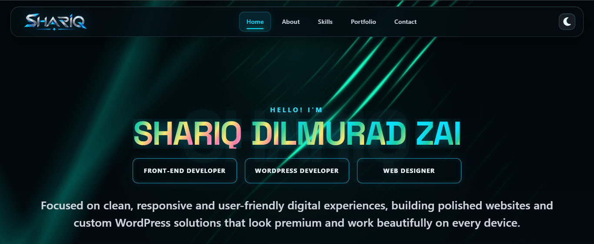

# Shariq Dilmurad Zai — Portfolio

A premium personal portfolio website built for a modern front-end developer and WordPress specialist. The project combines a dark luxury aesthetic, smooth animations, responsive sections, and a strong personal brand presence for showcasing work, experience, and technical skills.

<p align="center">
  
</p>

## Overview
This portfolio is designed to feel polished, credible, and conversion-focused while still feeling personal and unique. It includes a clean visual identity, animated motion system, detailed project showcase, and strong call-to-action sections for client outreach.

## Highlights
- Premium dark theme with green/cyan accents
- Responsive single-page portfolio layout
- Animated hero and scroll-based reveal effects
- Timeline for journey and experience
- Skills and technology showcase sections
- GitHub language activity section
- Project cards with unique visual treatments
- Contact form ready for outreach and inquiries
- Downloadable CV included

## Screenshot Preview

<p align="center">
  
</p>

## Tech Stack
- HTML5
- CSS3
- JavaScript
- GSAP animation
- Bootstrap
- Font Awesome
- Devicons
- GitHub API data integration

## How to Run
Open `index.html` directly in a browser, or serve the folder locally with a static server.

```bash
python -m http.server 8000
```
Then open:

```bash
http://localhost:8000
```

## GitHub Pages Deployment
To deploy on GitHub Pages:

1. Push the project to a GitHub repository.
2. Go to **Settings → Pages**.
3. Under **Source**, select your branch.
4. Save and wait for the deployment to publish.

## Project Assets
- `assets/images/shariq-logo.png` — primary SHARIQ wordmark
- `assets/images/shariq-favicon.png` — favicon and branding mark
- `assets/images/shariq-hero.png` — profile hero image
- `assets/images/portfolio-ss.png` — portfolio landing screen preview

## Contact
For project inquiries, collaborations, or new opportunities:

- Email: shariq.mailbox1@gmail.com
- LinkedIn: https://www.linkedin.com/in/shariq-dilmurad-zai-026b22418
- GitHub: https://github.com/Shari-q/

## License
This project is created for personal portfolio use and branding purposes.
